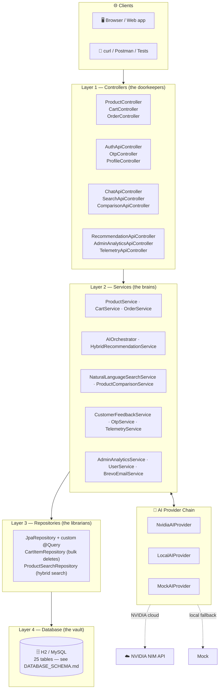
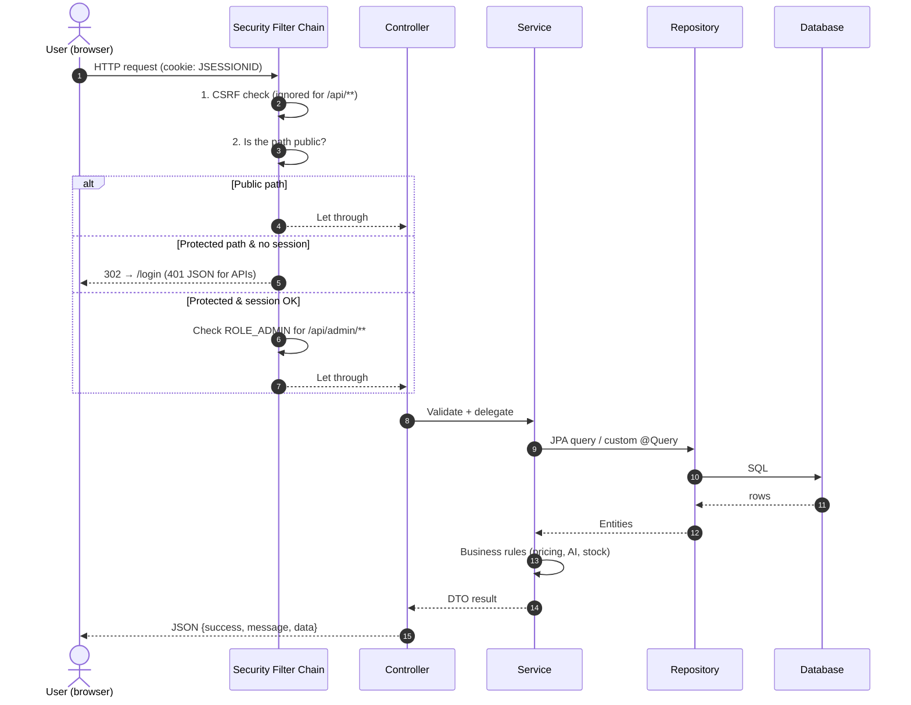
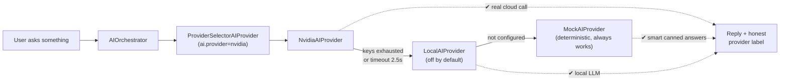
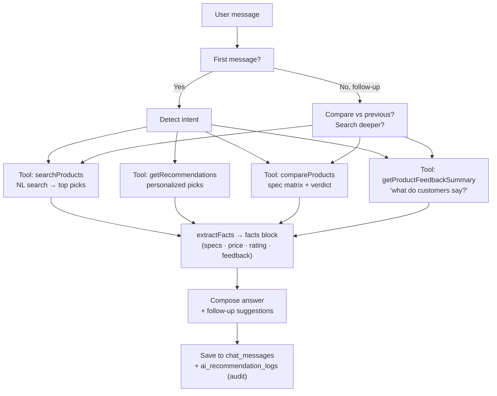
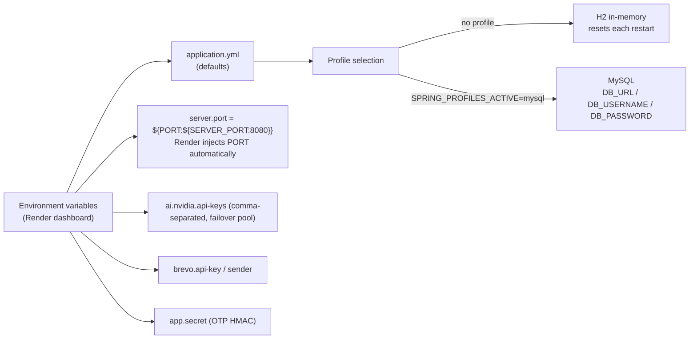

# ⚙️ OmniMart AI — Backend Architecture & API Schema

> The backend explained like a city map: here are the roads (URLs), the traffic
> lights (security), and the engines (AI) — with diagrams you can actually read.

---

## 1. The Stack at a Glance

| Layer | Technology |
|---|---|
| Language | Java 21 (compiled with `--release 21`) |
| Framework | Spring Boot 3.3.4 (Web MVC, Security, Data JPA, Validation, Mail, Scheduling) |
| Database | H2 in-memory (dev, default) · MySQL (production, `mysql` profile) |
| AI | NVIDIA NIM (primary) → local LLM (optional) → deterministic mock (always-works fallback) |
| Email | Brevo (Sendinblue) transactional API — invoice + OTP emails |
| Auth | Session-based (JSESSIONID cookie) + BCrypt passwords + OTP for new registrations |
| Hosting | Docker (Render) — health check at `/health` |

---

## 2. The Layered Architecture

Every request travels down **4 layers** and the answer travels back up:



**Rules of the road:**
- Controllers only translate HTTP ↔ Java — zero business logic.
- Services hold all the rules (pricing, AI, orders).
- Repositories only talk to the database.
- `ApiResponse<T>` wraps every answer: `{ success, message, data, timestamp }`.

---

## 3. The API — Every URL on the Map

### 🟢 Public (no login needed)

| Method | Path | What it does |
|---|---|---|
| GET | `/` | Service info + endpoint cheat-sheet |
| GET | `/health` | Render health check → `{status: UP}` |
| GET | `/products` | Catalog with filters: `category`, `brand`, `q`, `minPrice`, `maxPrice`, `minRating`, `sort`, `featured`, `page`, `size` |
| GET | `/products/{slug}` | Product detail page data (e.g. `apple-iphone-15-pro-max-103`) |
| GET | `/products/{id}/similar` | Similar products (same category) |
| POST | `/api/auth/register` | Create account (sends OTP email) |
| POST | `/api/auth/login` | Login → session cookie set |
| POST | `/api/otp/send` · `/api/otp/verify` | Email verification flow |
| POST | `/api/chat` | AI chat: `{message, conversationId?, history?}` → reply + products + provider used |
| POST | `/api/search/nl` | Natural-language search ("camera phone under 40000") |
| GET | `/api/search/autocomplete` | Search suggestions |
| GET | `/api/recommendations?limit=8` | Popular picks for guests; **personalized** if logged in |
| GET | `/api/compare/data?ids=1,4,7` | Side-by-side comparison (spec matrix, key differences, verdict) |
| POST | `/api/telemetry/interaction` | Anonymous click tracking (session-based) |
| GET | `/h2-console` | Dev database console |

### 🔒 Logged-in users only

| Method | Path | What it does |
|---|---|---|
| GET | `/api/auth/me` · POST `/api/auth/logout` | Who am I? / log out |
| GET | `/cart` · `/cart/count` | View cart / badge count |
| POST | `/cart/add` · `/cart/update` · `/cart/remove` | Cart operations (price snapshotted on add) |
| POST | `/checkout` | Place order → creates order + payment, reserves stock, clears cart, emails invoice |
| GET | `/orders` · `/orders/{id}` | Order history / detail |
| POST | `/orders/{id}/cancel` | Cancel (restocks, refunds) |
| GET/PUT | `/profile` | View / edit profile |
| POST | `/profile/addresses` | Add a shipping address |
| PUT | `/profile/preferences` | AI preferences (budget, categories, toggles) |
| POST | `/products/{id}/reviews` | Write a review (AI analyzes it immediately) |

### 🔐 Admins only (`ROLE_ADMIN`)

| Method | Path | What it does |
|---|---|---|
| GET | `/api/admin/analytics-data` | 17 KPIs: revenue, orders, top sellers, conversion, low stock, review sentiment… |
| POST | `/api/admin/ask-ai` | Ask the AI about store data ("what do customers complain about?") |

---

## 4. What Happens When a Request Arrives



---

## 5. The AI Subsystem (the fun part 🤖)

### 5.1 Provider chain with automatic failover



- Every response says **which provider actually answered** (`providerUsed`) — no pretending.
- `MockAIProvider` is a well-engineered offline brain: it parses queries with synonyms, strips filler words, and answers from real product data.

### 5.2 The chat brain (AIOrchestrator)



### 5.3 How recommendations are scored

```
final_score = 0.35 × preference match   ← what the user told us (budget, brands, categories)
            + 0.25 × behavior match     ← what the user did (clicks, carts, purchases)
            + 0.20 × content match      ← same category/brand as what they liked
            + 0.10 × rating             ← star rating
            + 0.10 × popularity         ← reviews & demand
```

Guests get the popularity ranking; logged-in users get the hybrid score.

---

## 6. Security, Step by Step

| Guard | How it works |
|---|---|
| Passwords | BCrypt (one-way hash, never reversible) |
| Sessions | JSESSIONID cookie, max 5 concurrent sessions per user |
| Login | Form login with `email` + `password`; admin role gates `/api/admin/**` |
| Registration | Email OTP (5-min validity, 5-attempt lockout) before account activates |
| CSRF | Enabled for HTML forms, **disabled for `/api/**`** (stateless API clients) |
| CORS | `localhost:*`, `127.0.0.1:*`, `https://*.onrender.com` with credentials |
| Dev mode | OTP code is returned in the response (`devCode`) so testing is painless |
| Secrets | `.env` for documentation; on Render: `AI_NVIDIA_APIKEYS`, `BREVO_API_KEY`, `BREVO_SENDER_EMAIL`, `BREVO_SENDER_NAME`, `APP_SECRET` |

---

## 7. Configuration Map



---

## 8. Testing the Backend (20-second smoke test)

```bash
# 1. Is it alive?
curl http://localhost:8080/health

# 2. Chat with the AI
curl -X POST http://localhost:8080/api/chat \
  -H "Content-Type: application/json" \
  -d "{\"message\":\"recommend a gaming laptop under 80000\"}"

# 3. Search naturally
curl -X POST http://localhost:8080/api/search/nl \
  -H "Content-Type: application/json" \
  -d "{\"query\":\"camera phone under 40000\"}"

# 4. Compare three products
curl "http://localhost:8080/api/compare/data?ids=1,4,7"

# 5. Login (demo) and check your cart
curl -c cookies.txt -X POST http://localhost:8080/api/auth/login \
  -H "Content-Type: application/json" \
  -d "{\"email\":\"user@omnimart.com\",\"password\":\"password123\"}"
curl -b cookies.txt http://localhost:8080/cart
```

**Demo accounts:** `admin@omnimart.com / admin123` · `user@omnimart.com / password123`

---

*Companion doc: [DATABASE_SCHEMA.md](DATABASE_SCHEMA.md) — the 25 tables behind these APIs.*
*Built with Spring Boot 3.3.4 · Java 21 · H2/MySQL · deployed on Render (Docker).*