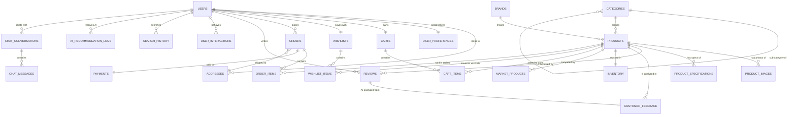
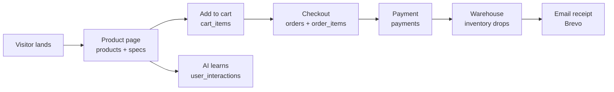

# 🗄️ OmniMart AI — Database Schema Explained

> A plain-English guide to every table in the OmniMart AI backend,
> with visual diagrams. If you can read a shopping receipt, you can read this doc. 😄

---

## 1. The Big Picture (30-second version)

OmniMart AI is an **online electronics store with an AI shopping assistant**. The database stores everything the store needs:

| You might call it… | The database calls it… |
|---|---|
| A shopper | `users` |
| A product on the shelf | `products` (+ `categories`, `brands`) |
| A shopping cart | `carts` + `cart_items` |
| "Save for later" | `wishlists` + `wishlist_items` |
| A purchase | `orders` + `order_items` + `payments` |
| A customer review | `reviews` (+ AI analysis in `customer_feedback`) |
| What the AI knows about you | `user_preferences`, `user_interactions`, `search_history`, `ai_recommendation_logs` |
| The AI chat | `chat_conversations` + `chat_messages` |
| Warehouse stock | `inventory` |
| Competitor prices | `market_products` |

**The golden rule:** every table (except a few standalone ones) hangs off one of two "anchors" —
👤 **who** (`users`) or 🛍️ **what** (`products`). If you understand those two, you understand everything.

---

## 2. Full Entity-Relationship Diagram



**Legend:** `||` = exactly one · `o{` = zero or many · `||--o{` = "one has many"

---

## 3. The Tables, Explained One by One

### 👤 People & Accounts

#### `users` — the people
| Column | What it is |
|---|---|
| `id` | Auto number |
| `email` | Login (unique) |
| `password` | BCrypt-hashed, never stored in plain text |
| `full_name`, `phone`, `avatar_url` | Profile info |
| `active` | Account disabled? |
| `roles` | `ROLE_USER` (shopper) or `ROLE_ADMIN` (store owner) |

**Demo users:** `admin@omnimart.com / admin123` · `user@omnimart.com / password123`

#### `addresses` — saved shipping addresses (home, office…)
One user → many addresses. `is_default` marks the usual one; `address_type` says HOME / OFFICE / OTHER.

#### `user_preferences` — what the AI knows you like
One user → exactly one preferences row. Stores favorite categories & brands (as JSON), a budget range (`min_budget` / `max_budget`), and two toggles:
- `recommendations_enabled` — "should I get AI recommendations?"
- `behavior_tracking_enabled` — "may the AI learn from my clicks?"

---

### 🛍️ The Catalog (what's for sale)

#### `categories` — shelf sections, can be nested
`Smartphones`, `Laptops`, `Headphones`, `Gaming`, `Smart Home`, `Cameras`, `Monitors`, `Accessories`.
A category can be a child of another (`parent_category_id`) — like a sub-shelf inside a shelf.

#### `brands` — who makes it
`Samsung`, `Apple`, `Sony`, `Dell`, `HP`, `Lenovo`, `Logitech`, `Canon` … with logo and website.

#### `products` — the items on the shelf
| Column | What it is |
|---|---|
| `name`, `slug`, `sku` | Name, URL-friendly name, barcode-like code |
| `price`, `original_price`, `discount_percentage` | Pricing + how much is knocked off |
| `stock`, `in_stock` | How many are left |
| `rating`, `review_count` | Star rating + how many reviews |
| `tags` | Comma-separated keywords the AI searches ("anc", "5g"…) |
| `featured`, `active` | Marketing flags |
| `category_id`, `brand_id` | Where it lives + who makes it |

#### `product_images` — photo gallery per product
#### `product_specifications` — the "spec sheet" table
Each row is one spec line, grouped (`spec_group` = Performance / Display / Battery…), so the AI can compare phones side-by-side.

#### `reviews` — star ratings & comments from buyers
One product → many reviews, one user → many reviews (a user can review the same product only once).

#### `inventory` — the warehouse ledger
Exactly one row per product: `stock_quantity`, `low_stock_threshold`, `reserved_quantity` (units held for in-flight orders), `warehouse_location`, `last_restocked_at`.

#### `market_products` — competitor prices
Lets the comparison engine answer "should I buy now or is it cheaper elsewhere?" — rows hold competitor name, price, URL, and when the price was last checked.

---

### 🛒 Shopping (cart & wishlist)

#### `carts` — one cart per logged-in user
Guests get a cart too, identified by `session_id` — when they log in, the cart is attached to their account.

#### `cart_items` — the rows of "1 × Samsung Galaxy A55 @ ₹36,999"
Links a cart to a product with `quantity` and the `unit_price` **at the time it was added** (prices don't change retroactively).

#### `wishlists` / `wishlist_items` — "save for later" (same pattern as cart)

---

### 📦 Orders & Payments (the money part)

#### `orders` — the receipt header
| Column | What it is |
|---|---|
| `order_number` | Human-friendly ID like `OM202608172331322419` |
| `total_amount`, `discount_amount`, `tax_amount`, `shipping_fee`, `final_amount` | Full money breakdown |
| `status` | `PENDING → CONFIRMED → SHIPPED → DELIVERED` (or `CANCELLED` / `RETURNED`) |
| `carrier`, `tracking_number` | Courier tracking |
| `estimated_delivery_date`, `delivered_at` | Delivery timeline |
| `cancellation_reason`, `return_reason`, `return_status` | Post-purchase notes |
| `shipping_address_id` | **Snapshot** of the address used (address changes later don't rewrite history) |

#### `order_items` — the receipt lines
Each line snapshots the product `name`, `image`, `unit_price`, and `quantity` — even if the product is later deleted or renamed, the receipt stays true.

#### `payments` — the payment for one order
One order → exactly one payment. `payment_method` (UPI / Card / COD), `transaction_id`, `status` (`PENDING` for COD until cash is collected, `COMPLETED` otherwise), `paid_at`.

---

### 🤖 AI & Personalization (what makes this store "smart")

#### `user_interactions` — the click trail
Every view, add-to-cart, purchase, search is one row: which user (or guest `session_id`), what action (`interaction_type`), which product/category/brand, what search query, and how long they looked.

#### `search_history` — past searches with result counts
Used for autocomplete and "people also searched".

#### `customer_feedback` — AI's opinion of every review
One row per review, produced by the AI when a review is submitted:
`sentiment` (Positive/Negative/Mixed), `emotion` (Happy/Frustrated…), `primary_topic`, plus the specific issues & positives extracted as JSON, and a `confidence_score` — so the AI can answer *"what do customers complain about?"* with real data.

#### `ai_recommendation_logs` — the AI's audit trail
Every recommendation request: what the user asked (`query_text`), which tool ran, which product IDs came back, the reasoning, **which AI provider** (NVIDIA / local / mock), and how long it took. Great for debugging and showing "the AI did what it said".

#### `chat_conversations` / `chat_messages` — the chat assistant
A conversation belongs to a user (or guest session). Each message stores the sender, content, tool calls, recommended product IDs, and a reasoning summary — so chat history can be replayed.

---

## 4. How It All Flows — Two Stories

### Story 1: Rahul buys a phone 📱



### Story 2: The AI recommends a laptop 💡

```mermaid
flowchart LR
    A[User asks<br/>"gaming laptop under 80000"] --> B[Chat message saved]
    B --> C[NL search tool<br/>products + specs + tags]
    C --> D[Rank by hybrid score]
    D --> E["Preferences 35% +<br/>behavior 25% +<br/>content 20% +<br/>rating 10% +<br/>popularity 10%"]
    E --> F[Return top picks]
    E --> G[Audit log<br/>ai_recommendation_logs]
    E --> H[Feedback Q&A<br/>customer_feedback]
```

---

## 5. Cheat Sheet — "Which table has my data?"

| I want to know… | Look in… |
|---|---|
| Who are my customers? | `users` |
| What sold the most? | `order_items` + `orders` |
| How much money came in? | `orders.final_amount` |
| What's running low? | `inventory` (below `low_stock_threshold`) |
| Which products got bad reviews? | `customer_feedback` (sentiment = Negative) |
| What did a user click before buying? | `user_interactions` |
| What did the AI recommend last week? | `ai_recommendation_logs` |
| Who has stuff in their cart but didn't buy? | `carts` + `cart_items` left vs `orders` |
| Is my price competitive? | `market_products` |

---

## 6. Good-to-know Details

- **Money** is stored as `BigDecimal` (never floating point) — ₹ calculations are exact.
- **Prices are snapshotted** in `cart_items` and `order_items`, so past receipts never change.
- **Two AI "memory" layers:** `user_preferences` (explicit: what you told us) and `user_interactions` (implicit: what you did).
- **Every table gets `created_at` / `updated_at`** timestamps from a shared base entity.
- **Demo data** (seeded on first boot): 8 categories, 12 brands, 10 users, 100 products, ~500 reviews, 55 orders, 550 interactions.
- **Default database:** in-memory H2 (resets on restart). For production, switch to MySQL with the `mysql` Spring profile.

---

*Generated for the OmniMart AI group project — Spring Boot 3.3.4 · Java 21 · H2/MySQL*